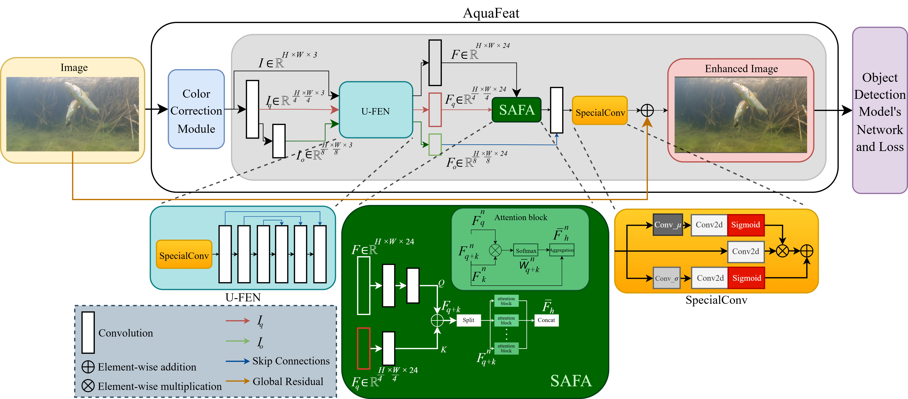
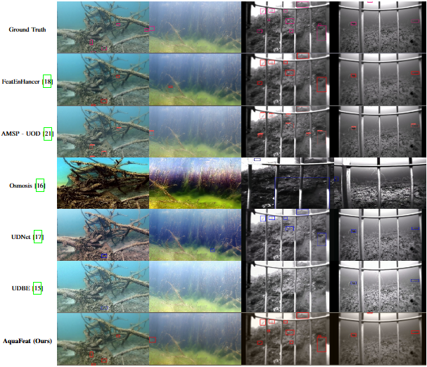

# AquaFeat: A Features-Based Image Enhancement Model for Underwater Object Detection

[](https://arxiv.org/abs/YOUR_PAPER_LINK_HERE)
[](https://opensource.org/licenses/MIT)

This is the official implementation of the paper: **"AquaFeat: A Features-Based Image Enhancement Model for Underwater Object Detection"**.

AquaFeat is a novel, **plug-and-play module** that performs task-driven feature enhancement to significantly improve object detection in challenging, low-light underwater environments.

## The Problem

Standard object detection models struggle in underwater settings due to severe image degradation. This includes:
* **Color Distortion:** Light absorption causes a dominant color cas.
* **Low Light & Contrast:** Light attenuates quickly with depth, leading to low luminosity.
* **Scattering & Blurring:** Suspended particles cause haze and reduce sharpness.

Traditional image enhancement methods often focus on improving visual appeal for humans, which doesn't necessarily improve detection accuracy and can be computationally expensive.

## Our Solution: AquaFeat

AquaFeat is different. It's a feature-level enhancement network that integrates directly with a detector (like YOLOv8m) and is **trained end-to-end with the detector's loss function**. This means the enhancement process is explicitly optimized to refine features that matter most for the *detection task* itself.

### Key Features
* 💡 **Task-Driven:** Optimizes features for detection, not just human-perceived image quality.
* 🔌 **Plug-and-Play:** A flexible module that can be integrated with various detection backbones (demonstrated with YOLOv8m and YOLOv10s).
* 🚀 **High Performance:** Achieves state-of-the-art **Precision (0.877)** and **Recall (0.624)** on challenging underwater datasets.
* ⚡ **Efficient:** Delivers significant accuracy gains while maintaining a practical processing speed (**46.5 FPS** with YOLOv8m).

### Architecture Overview


*Fig. 1: Overview of the AquaFeat architecture.*

The model works in three main stages:
1.  **Color Correction Module:** A non-trainable pre-processing step that balances color channel histograms to correct the dominant color cast.
2.  **Feature Enhancement Process:** A multi-scale network (U-FEN) that uses a content-aware **SpecialConv** layer and a **Scale-Aware Feature Aggregation (SAFA)** module to fuse hierarchical features.
3.  **Adaptive Residual Output:** A final layer generates a bounded enhancement map (residual), which is added back to the original image to create the enhanced, feature-rich input for the detector.

---

## Results

AquaFeat (integrated with YOLOv8m) achieves state-of-the-art Precision and Recall, significantly outperforming baseline YOLOv8m and other visual enhancement methods on the FishTrack23 dataset.

| Method | mAP@.5 | mAP@.5:.95 | **Precision** | **Recall** | FPS |
| :--- | :---: | :---: | :---: | :---: | :---: |
| YOLOv8m (Baseline) | 0.647 | 0.387 | 0.847 | 0.584 | 321.54 |
| AMSP-UOD | **0.724** | **0.460** | 0.866 | 0.578 | 41.84 |
| **AquaFeat + YOLOv8m (Ours)** | 0.677 | 0.421 | **0.877** | **0.624** | 46.51 |

### Qualitative Comparison

<div align="center">
  
</div>
*Fig. 2: Qualitative object detection comparison. As shown above (e.g., last column), AquaFeat can correctly detect objects in complex, low-visibility scenarios where other methods fail.*

---

## Installation

1.  Clone the repository:
    ```bash
    git clone https://github.com/EmanuelCostaS/AquaFeat
    cd AquaFeat
    ```
2.  Create and activate a virtual environment (e.g., Conda):
    ```bash
    conda create -n aquafeat python=3.10
    conda activate aquafeat
    ```
3.  Install dependencies:
    ```bash
    pip install -r requirements.txt
    ```

---

## Datasets

Our model was trained and evaluated using the following datasets:
* **Pre-training:** [DeepFish](https://github.com/fint-dataset/deepfish) and [OzFish](https://github.com/open-AIMS/ozfish).
* **Fine-tuning & Evaluation:** [FishTrack23](https://www.lirmm.fr/fishtrack/).

We created a processed, image-based version of the FishTrack23 dataset by sampling one annotated frame every 30 frames, resulting in 6,392 images.
**[[Link to download our processed FishTrack23 annotations and image lists](https://huggingface.co/datasets/PDI-DL/AquaFeat)]**

---

## Usage

### Inference

Run inference on an image or video:
```bash
python detect.py \
    --weights /path/to/aquafeat_yolov8m.pt \
    --source /path/to/your/image_or_video.mp4 \
    --conf 0.25
```

### Citation

If you find our work useful in your research, please consider citing our paper:
```BIBTEX
@inproceedings{Silva2025AquaFeat_unpub,
    author = {Silva, Emanuel da Costa and Schein, Tatiana Taís and 
              Brião, Stephanie Loi and Costa, Guilherme Louro Mano and 
              Oliveira, Felipe Gomes and Almeida, Gustavo Pereira and 
              Silva, Eduardo Lawson and Devincenzi, Sam da Silva and 
              Machado, Karina dos Santos and Drews-Jr, Paulo Lilles Jorge},
    affiliation = {Universidade Federal do Rio Grande and 
                   Universidade Federal do Rio Grande and 
                   Universidade Federal do Rio Grande and 
                   Universidade Federal do Rio Grande and 
                   Universidade Federal do Amazonas and 
                   Universidade Federal do Rio Grande and 
                   Universidade Federal do Rio Grande and 
                   Universidade Federal do Rio Grande and 
                   Universidade Federal do Rio Grande and 
                   Universidade Federal do Rio Grande},
    title = {AquaFeat: A features-based image enhancement model for underwater object detection},
    booktitle = {SIBGRAPI},
    year = {2025}
}
```
